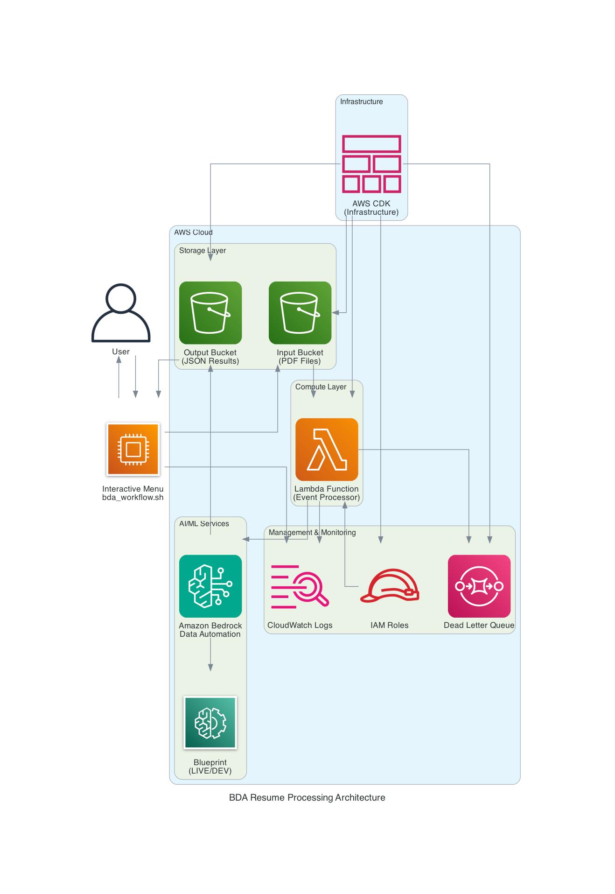

# BDA Resume Parser - Real-Time Processing

Automated resume parsing using Amazon Bedrock Data Automation with hierarchical data extraction and real-time S3 event triggers.

## Architecture



**Real-Time Event-Driven Processing:**
1. **S3 Upload** → Automatic trigger via S3 Event Notifications
2. **Lambda Processing** → BDA hierarchical blueprint extraction  
3. **Structured Output** → Organized JSON results saved to S3
4. **Error Handling** → DLQ + monitoring for failures

More detailed description in [Architecture](architecture/README.md)

**Key Benefits:**
- ✅ **Hierarchical Data Structure** - Organized sections (Personal, Education, Experience, Skills)
- ✅ **Sub-second triggers** - Immediate processing on upload
- ✅ **Auto-scaling** - Handle multiple concurrent resumes  
- ✅ **Infrastructure as Code** - Complete CDK deployment with blueprints
- ✅ **Development Workflow** - DEV → LIVE promotion for safe deployments

## Quick Start

### 🚀 **Interactive Menu-Driven Script**
```bash
# Launch interactive menu
./scripts/bda_workflow.sh data/sample_resume.pdf

# Menu Options:
# 1. Test in DEVELOPMENT stage
# 2. Promote blueprint to LIVE  
# 3. Process resume (Production)
# 4. Test in LIVE stage
# 5. Full workflow (DEV → Promote → LIVE)
# 6. Exit
```

### 1. Deploy Complete Infrastructure (Blueprint + Resources)
```bash
# Deploy everything with CDK (blueprint, project, S3, Lambda, etc.)
cd infrastructure
uv sync
uv run cdk bootstrap  # One-time setup
uv run cdk deploy

# Note: This creates blueprint and project in DEVELOPMENT stage
```

### 2. Test in Development
```bash
# Test with sample resume in DEV stage
uv run cli/test_upload.py data/sample_resume.pdf

# Verify results and blueprint performance
```

### 3. Promote to Production
```bash
# When ready, promote blueprint and project to LIVE stage
uv run cli/promote_blueprint.py

# Script automatically reads ARNs from CDK outputs - no manual input needed!
```

### 4. Interactive Processing
```bash
# 🚀 Launch interactive menu
./scripts/bda_workflow.sh data/sample_resume.pdf

# Choose from menu:
# Option 3: Production processing with blueprint stage verification
# Option 5: Full DEV→LIVE workflow automation
# Option 1-2: Individual development and promotion steps
# Option 4: LIVE stage testing
```

## Project Structure

```
bda_usecases/
├── infrastructure/              # CDK Infrastructure as Code
│   ├── app.py                  # CDK app entry point
│   ├── stacks/bda_stack.py     # S3, Lambda, IAM resources
│   └── pyproject.toml          # CDK dependencies
├── lambda/                     # Lambda function code
│   ├── handler.py              # S3 event processor
│   ├── bda_parser/             # Core BDA processing module
│   │   ├── bda_client.py       # BDA client with blueprint processing
│   │   ├── blueprint_schema.json # Custom extraction schema
│   │   └── config.py           # AWS configuration
│   └── pyproject.toml          # Runtime dependencies
├── cli/                        # Setup & testing tools
│   ├── promote_blueprint.py    # Promote DEV → LIVE stage
│   └── test_upload.py          # Manual upload testing
├── scripts/                    # Automation scripts
│   ├── bda_workflow.sh         # 🚀 Unified processing & workflow automation
│   └── cleanup.sh              # Infrastructure cleanup script
├── data/
│   └── sample_resume.pdf       # Test document
└── architecture/               # Architecture diagrams and documentation
    ├── README.md               # Detailed architecture overview
    ├── bda_architecture.png    # System architecture diagram
    └── bda_workflow.png        # Development workflow diagram
```

## Real-Time Processing Flow

### 1. **Automatic Trigger**
```
Resume Upload → s3://bucket/input/resume.pdf
                     ↓ (S3 Event Notification)
                Lambda Function Invoked
```

### 2. **Lambda Processing**
```python
# Lambda receives S3 event
{
  "Records": [{
    "s3": {
      "bucket": {"name": "bda-resume-bucket"},
      "object": {"key": "input/resume.pdf"}
    }
  }]
}

# Processes with BDA blueprint
# Saves results to output/ prefix
```

### 3. **Output Structure**
```
s3://bucket/
├── input/
│   └── 20240923_112801_resume.pdf     # Uploaded resume
└── output/
    └── 20240923_112801_resume/        # Processing results
        └── 0/custom_output/0/
            └── result.json            # Structured data
```

## Infrastructure Components

### AWS Resources (CDK Managed)
- **BDA Blueprint** - Hierarchical schema for resume extraction
- **BDA Data Automation Project** - Custom output configuration
- **S3 Bucket** - Resume storage with input/output prefixes
- **Lambda Function** - Event-driven BDA processing (15min timeout)
- **S3 Event Notifications** - Automatic trigger on input/ uploads
- **IAM Roles** - Lambda execution + BDA access permissions
- **DLQ + SNS** - Error handling and alerting
- **CloudWatch Logs** - Monitoring and debugging

### Development Workflow


1. **DEVELOPMENT Stage** - Blueprint and project created for testing
2. **Testing Phase** - Validate extraction quality with sample resumes
3. **LIVE Promotion** - Move to production when ready
4. **Monitoring** - CloudWatch logs and error tracking

### Hierarchical Blueprint Schema
Extracts structured resume data in organized sections:
```json
{
  "personal_info": {
    "full_name": "John Doe",
    "email": "john.doe@email.com", 
    "phone": "+1-555-0123",
    "address": "123 Main St, City, State",
    "linkedin": "linkedin.com/in/johndoe"
  },
  "educational_info": {
    "institution": "University of Technology",
    "degree": "Bachelor of Science in Computer Science",
    "graduation_year": "2020",
    "gpa": "3.8/4.0",
    "field_of_study": "Computer Science"
  },
  "experience": {
    "current_position": "Senior Software Engineer",
    "current_company": "Tech Corp",
    "years_total": "5 years",
    "key_achievements": "Led team of 8 developers...",
    "previous_roles": "Software Engineer at StartupXYZ..."
  },
  "skills": {
    "technical": "Python, JavaScript, AWS, Docker",
    "soft": "Leadership, Communication, Problem-solving",
    "languages": "English (Native), Spanish (Fluent)",
    "certifications": "AWS Solutions Architect",
    "tools": "Git, Jenkins, Kubernetes, Terraform"
  }
}
```

**Benefits of Hierarchical Structure:**
- ✅ **Organized Output** - Clear sections for downstream processing
- ✅ **Easy Integration** - Structured for databases and APIs
- ✅ **Maintainable Schema** - Reusable object definitions
- ✅ **Type Safety** - Consistent data types per section

## 🚀 Interactive Menu-Driven Script

### One Script with Interactive Menu
```bash
# Launch interactive menu
./scripts/bda_workflow.sh data/sample_resume.pdf

# Interactive Menu:
========================================
BDA Resume Processing Menu
========================================
Resume file: data/sample_resume.pdf

1. Test in DEVELOPMENT stage
2. Promote blueprint to LIVE
3. Process resume (Production)
4. Test in LIVE stage
5. Full workflow (DEV → Promote → LIVE)
6. Exit

Enter your choice (1-6):
```

### Script Features
- **🎯 Menu-Driven**: Clear numbered choices, no confusing prompts
- **🔍 Blueprint Verification**: Production mode checks blueprint stage
- **🎨 Beautiful Output**: Colored status messages and progress
- **📊 Smart Preview**: Displays extracted data summary
- **🛡️ Error Detection**: Monitors Lambda logs and exits on errors
- **📁 Organized Results**: Timestamped output files
- **⏳ Intelligent Waiting**: Polls with timeout protection
- **🔄 Return to Menu**: After each operation, returns to main menu
- **📋 Log Monitoring**: Real-time Lambda log tailing with cleanup

### Production Processing (Option 3)
- **Blueprint Stage Check**: Verifies blueprint is in LIVE stage
- **Smart Warnings**: Alerts if blueprint not promoted
- **User Choice**: Continue anyway, promote first, or return to menu
- **Safe Processing**: Ensures production-ready configuration

### Full Workflow (Option 5)
- **Automated Flow**: DEV testing → Promotion → LIVE testing
- **Seamless Experience**: No menu interruptions during workflow
- **Error Handling**: Stops and returns to menu on any failure
- **Complete Validation**: End-to-end system verification

## Performance & Scaling

### Real-Time Characteristics
- **Trigger Latency**: Sub-second S3 event notifications
- **Processing**: Optimized with LIVE blueprint for production workloads
- **Concurrency**: 1,000 concurrent Lambda executions (default)
- **Timeout**: 15 minutes per execution
- **Auto-scaling**: Handles multiple simultaneous uploads

### Cost Optimization
- **No idle costs** - Lambda charges per execution only
- **S3 storage** - Standard tier for input/output
- **BDA charges** - Per document processing
- **CloudWatch** - Logs and monitoring

## Error Handling

### Failure Scenarios
- **Invalid file formats** → Lambda error → DLQ
- **BDA processing failures** → Retry with exponential backoff
- **Timeout errors** → DLQ + SNS notification
- **Permission issues** → CloudWatch logs + alerts

### Monitoring
```bash
# Lambda function logs
aws logs tail /aws/lambda/BDAResumeStack-BDAProcessorFunction --follow

# DLQ messages (failed processing)
aws sqs receive-message --queue-url <dlq-url>

# S3 event notifications
aws s3api get-bucket-notification-configuration --bucket <bucket-name>
```

## Monitoring & Debugging

### Real-Time Monitoring
```bash
# Check Lambda logs (real-time)
aws logs tail /aws/lambda/BDAResumeStack-BDAProcessorFunction --follow

# List processed results
aws s3 ls s3://<bucket-name>/output/ --recursive

# Check CDK stack outputs
cd infrastructure && uv run cdk list --json
```

### Error Handling
```bash
# Check DLQ for failed processing
aws sqs receive-message --queue-url <dlq-url>

# S3 event configuration
aws s3api get-bucket-notification-configuration --bucket <bucket-name>
```

## Advanced Usage

### 🚀 Script Usage Options
```bash
# Interactive menu (recommended)
./scripts/bda_workflow.sh data/sample_resume.pdf

# Process multiple files (choose option 3 for each)
for file in resumes/*.pdf; do
    echo "Processing $file..."
    ./scripts/bda_workflow.sh "$file"
    # Select option 3 for production processing
done
```

### Infrastructure Management
```bash
cd infrastructure

# Preview changes before deployment
uv run cdk diff

# Deploy updates
uv run cdk deploy

# View stack outputs (ARNs, bucket names, etc.)
uv run aws cloudformation describe-stacks --stack-name BDAResumeStack --query "Stacks[0].Outputs"

# Cleanup (removes all resources)
uv run cdk destroy
```

### Complete Infrastructure Cleanup
The project includes a comprehensive cleanup script that safely removes all AWS resources:

```bash
# Safe cleanup - shows what would be deleted but doesn't delete
./scripts/cleanup.sh

# Force cleanup - actually deletes all resources
./scripts/cleanup.sh true
```

**Cleanup Script Features:**
- ✅ **Safe by default** - Dry run mode shows resources without deleting
- ✅ **CDK-aware** - Reads actual resources from CloudFormation stack
- ✅ **Comprehensive** - Removes S3 buckets, Lambda functions, BDA resources, IAM roles
- ✅ **Smart detection** - Finds resources even if stack is partially deleted
- ✅ **Force mode** - `true` argument enables actual deletion
- ✅ **Verification** - Confirms cleanup completion and shows any remaining resources

**What gets cleaned up:**
- CloudFormation stack (CDK-managed resources)
- S3 bucket and all contents
- Lambda functions
- BDA blueprints and projects
- SQS dead letter queues
- IAM roles and policies

**Usage Examples:**
```bash
# Check what would be deleted (safe preview)
./scripts/cleanup.sh

# Actually delete everything (use with caution)
./scripts/cleanup.sh true

# Alternative: CDK-only cleanup (may leave some resources)
cd infrastructure && uv run cdk destroy
```

### Alternative Processing Methods
```bash
# Direct S3 upload (bypasses automation)
aws s3 cp data/sample_resume.pdf s3://<bucket-name>/input/

# Manual blueprint promotion
uv run cli/promote_blueprint.py
```

### Blueprint Management
```bash
# View current blueprint status
aws bedrock-data-automation get-blueprint --blueprint-arn <arn> --region ap-south-1

# View project configuration  
aws bedrock-data-automation get-data-automation-project --project-arn <arn> --region ap-south-1
```

## Configuration

- **Region**: ap-south-1 (APAC)
- **Blueprint**: Hierarchical schema with 4 main sections
- **Deployment**: DEVELOPMENT → LIVE promotion workflow
- **File Formats**: PDF, DOC, images
- **Lambda Runtime**: Python 3.11
- **Memory**: 1024 MB
- **Timeout**: 15 minutes

## Key Features

### Hierarchical Data Extraction
- **Personal Info**: Contact details and LinkedIn
- **Educational Info**: Degrees, institutions, GPA
- **Experience**: Current role, achievements, history
- **Skills**: Technical, soft skills, certifications, tools

### Infrastructure as Code
- **Complete CDK Deployment**: Blueprint + Project + Infrastructure
- **Environment Management**: DEV/LIVE stage promotion
- **Automated Setup**: Single command deployment
- **Smart Promotion**: Auto-reads CDK outputs (no manual ARN copying)
- **Resource Management**: Proper cleanup and updates

### CDK Outputs Integration
The promotion script automatically reads these CDK outputs:
- `BlueprintArn` - For blueprint stage promotion
- `ProjectArn` - For project stage promotion  
- `BucketName` - S3 bucket for file uploads
- `LambdaFunctionName` - For monitoring and debugging

**No manual ARN management needed!** 🎉

## Troubleshooting

### Common Issues

**CDK Deployment Fails**
```bash
# Ensure you're in the right directory
cd infrastructure

# Check AWS credentials
aws sts get-caller-identity

# Bootstrap CDK (one-time setup)
uv run cdk bootstrap
```

**Promotion Script Can't Find Outputs**
```bash
# Verify stack is deployed
aws cloudformation describe-stacks --stack-name BDAResumeStack

# Check if you're in the right directory
# Script should be run from project root, not infrastructure/
uv run cli/promote_blueprint.py
```

**Blueprint Processing Fails**
```bash
# Check Lambda logs
aws logs tail /aws/lambda/BDAResumeStack-BDAProcessorFunction --follow

# Verify blueprint is in correct stage
aws bedrock-data-automation get-blueprint --blueprint-arn <arn> --region ap-south-1
```

**File Upload Issues**
```bash
# Check bucket exists and permissions
aws s3 ls s3://<bucket-name>/

# Verify file format is supported
file data/sample_resume.pdf
```
