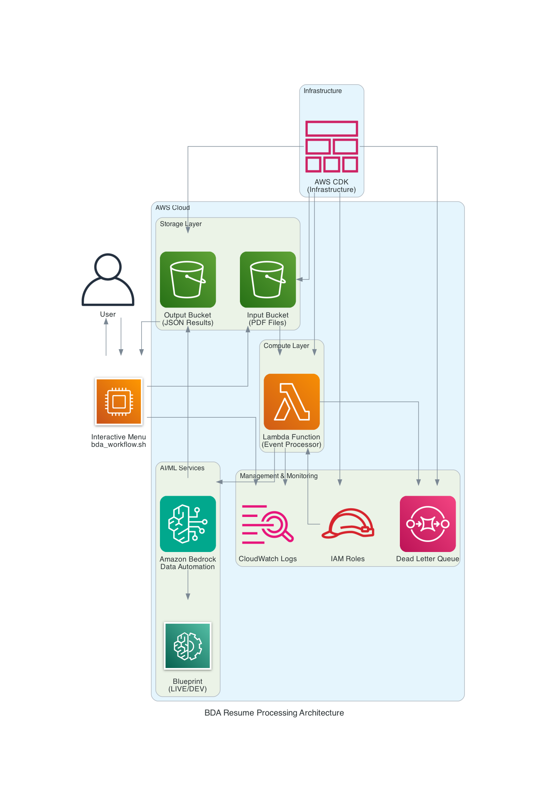
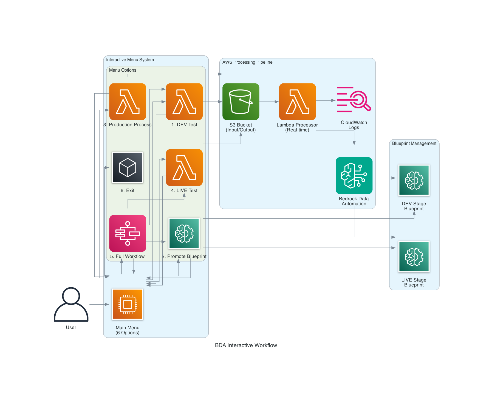

# BDA Resume Processing - Architecture Diagrams

This directory contains architecture diagrams for the BDA Resume Processing system, generated using AWS architecture diagrams.

## Diagrams

### 1. System Architecture

**Overview of the complete AWS infrastructure**

- **User Interaction**: Interactive menu-driven script
- **Storage Layer**: S3 buckets for input PDFs and output JSON results
- **Compute Layer**: Lambda function for event processing
- **AI/ML Services**: Amazon Bedrock Data Automation with blueprint management
- **Management**: CloudWatch logs, IAM roles, and error handling
- **Infrastructure**: AWS CDK for infrastructure as code

### 2. Interactive Workflow (`bda_workflow.png`)

**Detailed view of the menu-driven user experience**

- **Menu System**: 6 interactive options for different operations
- **Processing Pipeline**: Real-time AWS processing with monitoring
- **Blueprint Management**: DEV and LIVE stage blueprint handling
- **Return Flow**: All operations return to the main menu

### 3. Data Flow (`bda_dataflow.png`)

**Step-by-step data processing pipeline**

- **Upload Stage**: Script uploads PDF to S3
- **Event Trigger**: S3 events trigger Lambda processing
- **BDA Processing**: Bedrock processes with blueprint extraction
- **Results Stage**: Structured JSON output to S3
- **Monitoring**: Real-time logs and error handling
- **Menu Return**: Results downloaded and control returned to menu

## Key Features Illustrated

### Interactive Menu System
- **6 Operation Modes**: Development testing, blueprint promotion, production processing, LIVE testing, full workflow, and exit
- **User-Friendly**: Clear numbered choices with return-to-menu functionality
- **Error Handling**: Graceful error handling with menu return

### AWS Architecture
- **Event-Driven**: S3 events trigger Lambda processing automatically
- **Scalable**: Lambda auto-scaling for concurrent processing
- **Monitored**: Real-time CloudWatch logging with error detection
- **Secure**: IAM roles for proper access control

### Blueprint Management
- **Stage Control**: Separate DEV and LIVE blueprint stages
- **Production Safety**: Blueprint verification for production processing
- **Automated Promotion**: Script-driven promotion from DEV to LIVE

### Data Processing
- **Hierarchical Extraction**: Structured JSON output with organized sections
- **Real-time Processing**: Sub-second trigger with ~24 second processing
- **Error Recovery**: Dead letter queue and retry logic
- **Results Management**: Timestamped results with preview functionality

## Technology Stack

- **AWS Services**: S3, Lambda, Bedrock, CloudWatch, IAM, SQS
- **Infrastructure**: AWS CDK (TypeScript)
- **Processing**: Python Lambda functions with direct code inclusion
- **Automation**: Bash script with interactive menu system
- **Monitoring**: Real-time log tailing and error detection

## Usage Context

These diagrams support the documentation in:
- `README.md` - Main project documentation
- `dataflow.md` - Detailed data flow specifications
- `scripts/bda_workflow.sh` - Interactive processing script

The architecture is designed for:
- **Development**: Safe testing in DEV stage
- **Production**: Verified processing in LIVE stage  
- **Automation**: Complete workflow automation
- **Monitoring**: Real-time visibility and error handling